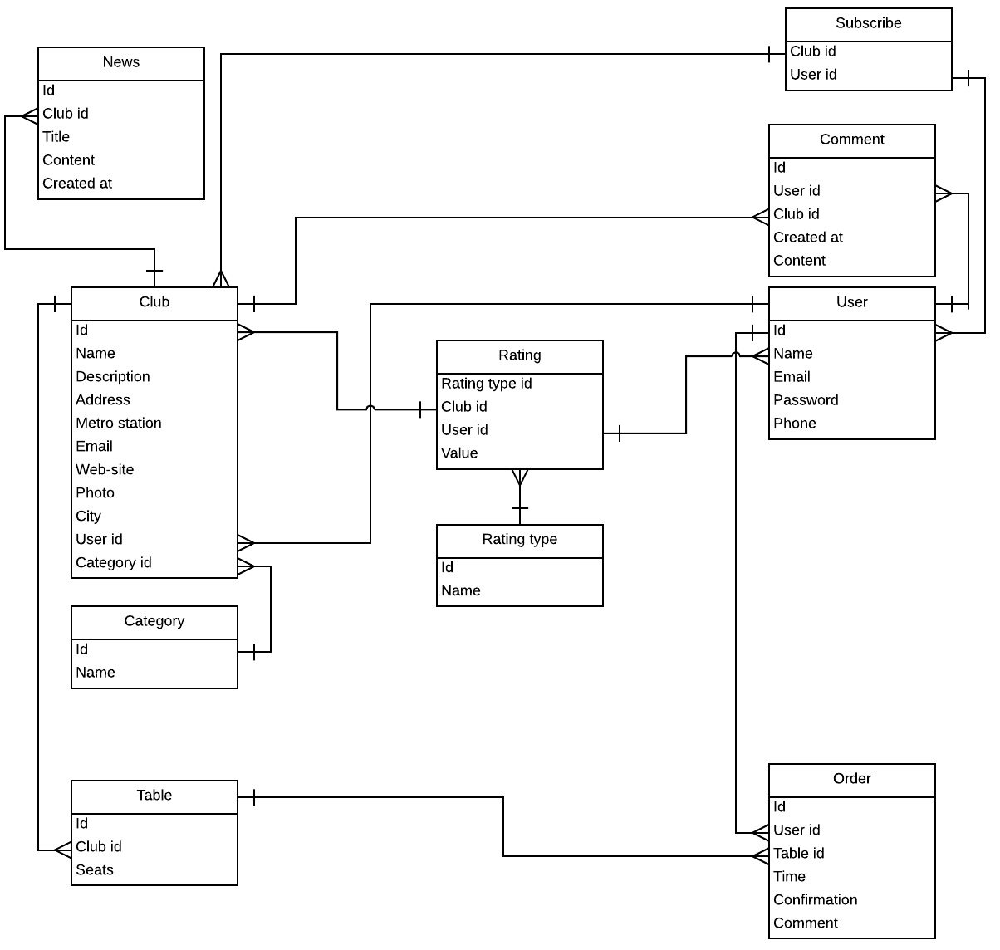

# Введение
Задача настоящей работы – создание базы данных для веб-ресурса. В качестве веб-ресурса рассмотрим веб-сервис [smartreserve.by](http://smartreserve.by), предназначенный для бронирования мест в ресторанах в режиме онлайн, написанный на фреймворке Ruby on Rails и использующий СУБД PostgreSQL.

## История развития баз данных

Информационная система представляет собой программно-аппаратный комплекс, обеспечивающий выполнение следующих функций:
* надёжное хранение информации в памяти компьютера;
* выполнение специфических преобразований информации и вычислений;
* предоставление пользователям удобного и легко осваиваемого интерфейса.

Обычно такие системы имеют дело с большими объемами информации, имеющей достаточно сложную структуру. Классическими примерами информационных систем являются банковские системы, автоматизированные системы управления предприятиями, системы резервирования авиационных или железнодорожных билетов, мест в гостиницах и т.д. и т.п. Эта (вторая) область использования вычислительной техники возникла несколько позже первой, т.к. на заре вычислительной техники возможности компьютеров по хранению информации были очень ограниченными.

В первых компьютерах использовались два вида устройств внешней памяти – магнитные ленты и барабаны (что, как мы увидим, наложило свой серьёзный отпечаток на способы физического хранения данных в БД). Ёмкость магнитных лент была достаточно велика, но по своей физической природе они обеспечивали последовательный доступ к данным. Магнитные барабаны (они ближе всего к современным магнитным дискам с фиксированными головками) давали возможность произвольного доступа к данным, но имели малый объём хранимой информации. Эти ограничения не являлись слишком существенными для чисто численных расчётов. 
Даже если программа должна обработать (или произвести) большой объем информации, при программировании можно продумать расположение этой информации во внешней памяти (например, на последовательной магнитной ленте), обеспечивающее эффективное выполнение этой программы.

Однако в информационных системах совокупность взаимосвязанных информационных объектов фактически отражает модель объектов реального мира, а потребность пользователей в информации требует быстрой реакции системы на их запросы. И в этом случае наличие сравнительно медленных устройств хранения данных, к которым относятся магнитные ленты и барабаны, было недостаточным.

С появлением магнитных дисков началась история систем управления данными во внешней памяти. До этого каждая прикладная программа, которой требовалось хранить данные во внешней памяти, сама определяла расположение каждой порции данных на магнитной ленте или барабане и выполняла обмены между оперативной памятью и устройствами внешней памяти с помощью программно-аппаратных средств низкого уровня (машинных команд или вызовов соответствующих программ операционной системы). Такой режим работы не позволяет или очень затрудняет поддержание на одном внешнем носителе нескольких архивов долговременно хранимой информации. Кроме того, каждой прикладной программе приходилось решать проблемы именования частей данных и структуризации данных во внешней памяти.

Важным шагом в развитии именно информационных систем явился переход к использованию централизованных систем управления файлами. С точки зрения прикладной программы, файл – это именованная область внешней памяти, в которую можно записывать и из которой можно считывать данные.
На смену файлам пришли потоки данных. Фактически, с точки зрения программы, это те же файлы, которые «в реальности» могут быть сокетами, «обёртками» различных сетевых протоколов или внешних аппаратных устройств. Правила именования файлов, способ доступа к данным, хранящимся в файле, и структура этих данных зависят от конкретной системы управления файлами и, возможно, от типа файла.

Система управления файлами берёт на себя распределение внешней памяти, отображение имён файлов в соответствующие адреса во внешней памяти и обеспечение доступа к данным. Пользователи видят файл как линейную последовательность записей и могут выполнить над ним ряд стандартных операций:
* создать файл (требуемого типа и размера);
* открыть ранее созданный файл;
* прочитать из файла некоторую запись (текущую, следующую, предыдущую, первую, последнюю);
* записать в файл на место текущей записи новую, добавить новую запись в конец файла.

Главное, что следует отметить, – это то, что структура записи файла была известна только программе, которая с ним работала, система управления файлами не знала её. И поэтому для того, чтобы извлечь некоторую информацию из файла, необходимо было точно знать структуру записи файла с точностью до бита. Каждая программа, работающая с файлом, должна была иметь у себя внутри структуру данных, соответствующую структуре этого файла. Такая ситуации характеризовалась как зависимость программ от данных.

Для информационных систем характерным является наличие большого числа различных пользователей (программ), каждый из которых имеет свои специфические алгоритмы обработки информации, хранящейся в одних и тех же файлах. Изменение структуры файла, которое было необходимо для одной программы, требовало исправления и перекомпиляции и дополнительной отладки всех остальных программ, работающих с этим же файлом. Это было первым существенным недостатком файловых систем, который явился толчком к созданию новых систем хранения и управления информацией. Далее, поскольку файловые системы являются общим хранилищем файлов, принадлежащих разным пользователям, системы управления файлами должны обеспечивать авторизацию доступа к файлам.

В общем виде подход состоит в том, что по отношению к каждому зарегистрированному пользователю данной вычислительной системы для каждого существующего файла указываются действия, которые разрешены или запрещены данному пользователю. В большинстве современных систем управления файлами применяется подход к защите файлов, впервые реализованный в ОС UNIX. Для множества файлов, отражающих информационную модель одной предметной области, децентрализованный принцип управления доступом вызывал дополнительные трудности. Отсутствие централизованных методов управления доступом к информации послужило ещё одной причиной разработки СУБД.

Следующей причиной стала необходимость обеспечения эффективной параллельной работы многих пользователей с одними и теми же файлами. Если операционная система поддерживает многопользовательский режим, вполне реальна ситуация, когда два или более пользователя одновременно пытаются работать с одним и тем же файлом. 

Если все пользователи собираются только читать файл, ничего страшного не произойдёт. Но если хотя бы один из них будет изменять файл, для корректной работы этих пользователей требуется взаимная синхронизация их действий по отношению к файлу.

В системах управления файлами обычно применялся следующий подход. В операции открытия файла (первой и обязательной операции, с которой должен начинаться сеанс работы с файлом) среди прочих параметров указывался режим работы (чтение или изменение). Если к моменту выполнения этой операции некоторым пользовательским процессом PR1 файл был уже открыт другим процессом PR2 в режиме изменения, то в зависимости от особенностей системы процессу PR1 либо сообщалось о невозможности открытия файла, либо он блокировался до тех пор, пока в процессе PR2 не выполнялась операция закрытия файла. При подобном способе организации одновременная работа нескольких пользователей, связанная с модификацией данных в файле, либо вообще не реализовывалась, либо была очень медленной.

Эти недостатки послужили тем толчком, который заставил разработчиков информационных систем предложить новый подход к управлению информацией. Этот подход был реализован в рамках новых программных систем, названных впоследствии Системами Управления Базами Данных (СУБД), а сами хранилища информации, которые работали под управлением данных систем, назывались базами или банками данных.

### Этапы развития баз данных

#### Первый этап развития БД – базы данных на больших ЭВМ

История развития СУБД насчитывает более 30 лет.

В 1968 году была введена в эксплуатацию первая промышленная СУБД IMS фирмы IBM.

В 1975 году появился первый стандарт ассоциации по языкам систем обработки данных – Conference of Data System Languages (CODASYL), который определил ряд фундаментальных понятий в теории систем баз данных, которые и до сих пор являются основополагающими для сетевой модели данных.

В дальнейшее развитие теории баз данных большой вклад был сделан американским математиком Э.Ф. Коддом, который является создателем реляционной модели данных.

Развитие персональных ЭВМ и появление мощных рабочих станций и сетей ЭВМ повлияло также и на развитие технологии баз данных.

Можно выделить четыре этапа в развитии данного направления в обработке данных. Однако необходимо заметить, что всё же нет жёстких временных ограничений в этих этапах: они плавно переходят один в другой и даже сосуществуют параллельно, но тем не менее выделение этих этапов позволит более чётко охарактеризовать отдельные стадии развития технологии баз данных, подчеркнуть особенности, специфичные для конкретного этапа.

Первый этап развития СУБД связан с организацией баз данных на больших машинах типа IBM 360/370, ЕС-ЭВМ и мини-ЭВМ типа PDP11 (фирмы Digital Equipment Corporation – DEC), разных моделях HP (фирмы Hewlett Packard).

Базы данных хранились во внешней памяти центральной ЭВМ, пользователями этих баз данных были задачи, запускаемые в основном в пакетном режиме. Интерактивный режим доступа обеспечивался с помощью консольных терминалов, которые не обладали собственными вычислительными ресурсами (процессором, внешней памятью) и служили только устройствами ввода-вывода для центральной ЭВМ.

Мощные операционные системы обеспечивали возможность условно параллельного выполнения всего множества задач. Эти системы можно было отнести к системам распределённого доступа, потому что база данных была централизованной, хранилась на устройствах внешней памяти одной центральной ЭВМ, а доступ к ней поддерживался от многих пользователей-задач.

Особенности этого этапа развития выражаются в следующем:
* все СУБД базируются на мощных мультипрограммных операционных системах (MVS, SVM, RTE, OSRV, RSX, UNIX), поэтому в основном поддерживается работа с централизованной базой данных в режиме распределённого доступа;
* функции управления распределением ресурсов в основном осуществляются операционной системой;
* поддерживаются языки низкого уровня манипулирования данными, ориентированные на навигационные методы доступа к данным;
* значительная роль отводится администрированию данных;
* проводятся серьёзные работы по обоснованию и формализации реляционной модели данных;
* проводятся теоретические работы по оптимизации запросов и управлению распределённым доступом к централизованной БД, было введено понятие транзакции;
* появляются первые языки высокого уровня для работы с реляционной моделью данных, однако отсутствуют стандарты для этих первых языков.

#### Второй этап – «эпоха персональных компьютеров»

На этом этапе появилось множество программ, предназначенных для работы неподготовленных пользователей. Простыми и понятными стали операции копирования файлов и перенос информации с одного компьютера на другой. Появились программы, которые назывались системами управления базами данных и позволяли хранить значительные объёмы информации, они имели удобный интерфейс для заполнения данных и встроенные средства для генерации различных отчётов. Эти программы позволяли автоматизировать многие учётные функции, которые раньше велись вручную.

Компьютеры стали инструментом для ведения документации и собственных учётных функций организациями и отдельными пользователями. Спрос на развитые удобные программы обработки данных заставлял поставщиков программного обеспечения поставлять всё новые системы, которые принято называть настольными (desktop) СУБД.

Значительная конкуренция среди поставщиков заставляла совершенствовать эти системы, предлагая новые возможности, улучшая интерфейс и быстродействие систем, снижая их стоимость.

Наличие на рынке большого числа СУБД, выполняющих сходные функции, потребовало разработки методов экспорта-импорта данных для этих систем и открытия форматов хранения данных.

Особенности этого этапа таковы:
* все СУБД были рассчитаны на создание БД в основном с монопольным доступом (т.к. компьютер – персональный и не подсоединён к сети);
* в редких случаях предполагалась последовательная работа нескольких пользователей, например, сначала оператор, который вводил бухгалтерские документы, а потом главбух, который определял проводки, соответствующие первичным документам;
* большинство СУБД имели развитый и удобный пользовательский интерфейс;
* большинство СУБД предлагали развитый и удобный инструментарий для разработки готовых приложений без программирования;
* инструментальная среда состояла из готовых элементов приложения в виде шаблонов экранных форм, отчётов, графических конструкторов запросов, которые достаточно просто могли быть собраны в единый комплекс;
* во всех настольных СУБД поддерживался только внешний уровень представления реляционной модели, то есть только внешний табличный вид структур данных;
* при наличии высокоуровневых языков манипулирования данными типа реляционной алгебры и SQL в настольных СУБД поддерживались низкоуровневые языки манипулирования данными на уровне отдельных строк таблиц;
* в настольных СУБД отсутствовали средства поддержки ссылочной и структурной целостности базы данных, эти функции должны были выполнять приложения;
* наличие монопольного режима работы фактически привело к вырождению функций администрирования БД и в связи с этим – к отсутствию инструментальных средств администрирования БД;
* требования к аппаратному обеспечению со стороны настольных СУБД были сравнительно скромными.

Яркие представители этого семейства – очень широко использовавшиеся до недавнего времени СУБД Dbase (DbaseIII+, DbaseIV), FoxPro, Clipper, Paradox, MS Access.

#### Третий этап – распределённые базы данных

После процесса «персонализации» начался обратный процесс – интеграция.

С развитием компьютерных сетей остро встала задача согласованности данных, логически связанных друг с другом, но хранящихся и обрабатывающихся в разных местах. Возникли задачи, связанные с параллельной обработкой транзакций – последовательностей операций над БД, переводящих её из одного непротиворечивого состояния в другое непротиворечивое состояние. Успешное решение этих задач приводит к появлению распределённых баз данных, сохраняющих все преимущества настольных СУБД и в то же время позволяющих организовать параллельную обработку информации и поддержку целостности БД.

Особенности данного этапа:
* практически все современные СУБД обеспечивают поддержку полной реляционной модели;
* большинство современных СУБД рассчитаны на многоплатформенную архитектуру, то есть они могут работать на компьютерах с разной архитектурой и под разными операционными системами, при этом для пользователей доступ к данным, управляемым СУБД на разных платформах, практически неразличим;
* необходимость поддержки многопользовательской работы с базой данных и возможность децентрализованного хранения данных потребовали развития средств администрирования БД с реализацией общей концепции средств защиты данных;
* потребность в реализации новых СУБД вызвала создание серьёзных теоретических трудов по оптимизации распределённых БД и работе с распределёнными транзакциями и запросами;
* чтобы не потерять клиентов, которые ранее работали на настольных СУБД, практически все современные СУБД имеют средства подключения клиентских приложений, разработанных с использованием настольных СУБД, и средства экспорта данных из форматов настольных СУБД второго этапа развития;
* именно к этому этапу можно отнести разработку ряда стандартов в рамках языков описания и манипулирования данными начиная с SQL89, SQL92, SQL99 (и т.д.) и технологий по обмену данными между различными СУБД, к которым можно отнести и протокол ODBC (Open DataBase Connectivity), предложенный фирмой Microsoft;
* именно к этому этапу можно отнести начало работ, связанных с концепцией объектно-ориентированных БД – ООБД.

Первыми представителями СУБД, относящимся к этому этапу, можно считать Oracle7.3, Oracle 8.4 MS SQL6.5, MS SQL7.0, System 10, System 11, Informix, DB2, SQL Base и т.п.

#### Четвёртый этап – дальнейшее развитие

Этот этап характеризуется появлением новой технологии доступа к данным – «интернет/интранет-доступ». Основное отличие этого подхода от технологии клиент-сервер состоит в том, что отпадает необходимость использования специализированного клиентского программного обеспечения. Для работы с удалённой БД используется стандартный веб-браузер.

При этом код, написанный обычно на языках программирования (Java, PHP, Perl, C#) отслеживает все действия пользователя и транслирует их в низкоуровневые SQL-запросы к базе данных, выполняя, таким образом, ту работу, которой в технологии клиент-сервер занимается клиентская программа.

Удобство данного подхода привело к тому, что он стал использоваться не только для удалённого доступа к базам данных, но и для пользователей локальной сети предприятия, т.к. для подключения нового пользователя не требуется установка дополнительного клиентского программного обеспечения.

У каждого из вышеперечисленных подходов к работе с данными есть свои достоинства и свои недостатки, которые и определяют область применения того или иного метода, и в настоящее время все подходы широко используются.

## Краткие теоретические сведения
*Данные* - это представление фактов и идей в формализованном виде, пригодном для передачи и обработки в некотором информационном процессе.

*База Данных* (БД, database) - структурированный организованный набор данных, описывающих характеристики какой-либо физической или виртуальной системы. «Базой данных» часто упрощённо или ошибочно называют Системы Управления Базами Данных (СУБД, database management system, DBMS). Нужно различать набор данных (собственно БД) и программное обеспечение, предназначенное для организации и ведения баз данных (СУБД).

Организация структуры БД формируется, исходя из следующих соображений:
1. Адекватность описываемому объекту или системе - на уровне концептуальной и логической модели.
2. Удобство использования для ведения учёта и анализа данных - на уровне так называемой физической модели.

Виды концептуальных (инфологических) моделей БД:
* «сущность-связь» (англ. entity-relation, ER);
* семантические модели;
* графовые модели.

Виды логических (даталогических) моделей БД:
* документальные (архивы) - ориентированные на формат документа, дескрипторные, тезаурусные;
* фактографические (картотеки);
* теоретико-графовые: иерархическая модель, сетевая модель;
* теоретико-множественные: реляционная модель (ER-модель), многомерная модель;
* объектно-ориентированные: объектная модель;
* основанные на инвертированных файлах (инвертированные файлы содержат: словарь, содержащий все термы, встретившиеся в коллекции и ссылку на массив данных «пост-листа» для каждого из них; «пост-листы», представляющие собой массив информации обо всех вхождениях данного слова в документы коллекции).

Модель «сущность-связь» основывается на некой важной семантической информации о реальном мире и предназначена для логического представления данных. Она определяет значения данных в контексте их взаимосвязи с другими данными. Важным для нас является тот факт, что из модели «сущность-связь» могут быть порождены все существующие модели данных (иерархическая, сетевая, реляционная, объектная), поэтому она является наиболее общей. Модель «сущность-связь» была предложена в 1976 г. Питером Пин-Шэн Ченом. 

Любая развитая семантическая модель данных, как и реляционная модель, включает структурную, манипуляционную и целостную части, главным назначением семантических моделей является обеспечение возможности выражения семантики данных. Чаще всего на практике семантическое моделирование используется на первой стадии проектирования базы данных. При этом в терминах семантической модели производится концептуальная схема базы данных, которая затем вручную преобразуется к реляционной (или какой-либо другой) схеме.

Основным достоинством данного подхода является отсутствие потребности в дополнительных программных средствах, поддерживающих семантическое моделирование. Требуется только знание основ выбранной семантической модели и правил преобразования концептуальной схемы в реляционную схему.

Графовые модели данных отражают совокупность объектов реального мира в виде графа взаимосвязанных информационных объектов. В зависимости от типа графа выделяют иерархическую или сетевую модели. Исторически эти модели появились раньше, и в настоящий момент они используются реже, чем более современная реляционная модель данных.

### Многоуровневая архитектура баз данных, понятие физического и логического уровней баз данных

Проектирование БД начинается с этапа «концептуального проектирования».

Концептуальное проектирование - это сбор, анализ и редактирование требований к данным. Для этого осуществляются следующие мероприятия:
* обследование предметной области, изучение её информационной структуры;
* выявление всех фрагментов предметной области, каждый из которых характеризуется представлением, информационными объектами и связями между ними, процессами над информационными объектами;
* моделирование и интеграция всех представлений.

По окончании этапа концептуального проектирования мы получаем «концептуальную модель», инвариантную (нечувствительную) к структуре базы данных. Эта модель будет нас интересовать на «инфологическом уровне» схемы, представленной на следующем рисунке. Часто такая модель представляется в виде модели «сущность-связь».

Следующий этап - логическое проектирование.
Логическое проектирование - преобразование требований к данным в структуры данных. На выходе этого этапа мы получаем СУБД-ориентированную структуру базы данных и спецификации прикладных программ. На этом этапе часто моделируют базы данных применительно к различным СУБД и проводят сравнительный анализ моделей. Эта модель будет нас интересовать на «даталогическом уровне» схемы, представленной на следующем рисунке.

Следующий этап - физическое проектирование.
Физическое проектирование - определение особенности хранения данных, методов доступа и т.д. На выходе этого этапа мы получаем «физическую модель» базы данных. Эта модель будет нас интересовать на «физическом уровне» схемы, представленной на следующем рисунке.


*Рисунок. 1 Схема уровней БД*

Различие уровней представления проще понять из того, кем они реализуется и что на них реализуется:

концептуальный (инфологический) уровень
  * реализуется аналитиком (используется инфологическая модель «сущность-связь»);
  * формируются сущности;
  * формируются атрибуты;
  * формируются связи.

логический (даталогический) уровень
  * реализуется программистом;
  * определяются записи;
  * определяются элементы и типы данных;
  * определяются способы организации связей между записями.
  
физический уровень
  * реализуется администратором;
  * определяется группирование данных;
  * определяются индексы;
  * определяются методы доступа.

# Разработка БД
## ER-модель


На рисунке 2 представлена ER-модель базы данных приложения. Рассмотрим ее сущности подробнее.

В базе данных нам необходимо хранить информацию о заведениях, пользователях и заказах. Получаем следующие модели:

_Пользователь_
1. Email
2. Телефон
3. Имя
4. Пароль

_Заведение_
1. Имя
3. Описание
6. Адрес
7. Фото
8. Владелец
8. Категория
9. Город
11. Веб-страница
12. Станция метро
13. Email

_Категория_
1. Название категории

_Заказ_
1. Столик
2. Пользователь
2. Время
5. Код подтверждения
6. Комментарий

_Столик_
1. Заведение
3. Количество мест

Владелец заведения может публиковать новости, а пользователи могут на них подписываться:

_Новости_
1. Заголовок
2. Контент
3. Время публикации
4. Заведение

_Подписка_
1. Пользователь
2. Заведение

Также пользователи могут оставлять комментарии к заведению и оценивать его по нескольким параметрам (например, кухня, сервис или атмосфера):

_Комментарий_
1. Содержание
2. Пользователь
3. Заведение
4. Время создания

_Рейтинг_
1. Тип
2. Заведение
3. Пользователь
4. Баллы

_Тип рейтинга_
1. Название

## Выбор СУБД
Проект выдвигает следующие требования к СУБД:
 * Мультиплатформенность
 * Невысокие системные требования
 * Свободная лицензия
 * Существующая интеграция с ORM Active Record фреймворка Rails
 * Поддержка облчной платформой Heroku.
Сравним три популярнейших СУБД в экосистеме Rails: MySQL, PostgreSQL и SQLite

Общие сведения

| | MySQL | PostreSQL | SQLite|
|--|------|-----------|-------|
| Разработчик | Oracle Corporation | PostgreSQL Global Development Group | Ричард Хипп |
| Дата выпуска первой версии | 1995-11 | 1989-06 | 2000-08-17 |
| Последняя стабильная версия | 5.6.2 | 9.3.4 | 3.8.0.2|
| Дата посленего релиза | 2014-09 | 2014-03-20 | 2013-09-03|
| Лицензия | GPL v2 или Проприетарная | PostgreSQL License | Public domain|
| Поддерживаемые ОС | Windows, Linux, OS X, BSD | Windows, Linux, OS X, BSD | Windows, Linux, OS X, BSD|
| Выполнение ACID-принципов | Да | Да | Да |
| Ссылочная целостность | Частично | Да | Да |
| Транзакции | Кроме DDL | Да | Да |
| Поддержка Юникода | Кроме регулярных выражений | Да | Да |

Пределы хранимых данных

| | MySQL | PostreSQL | SQLite|
|--|------|-----------|-------|
| Размер БД | Неограничен | Неограничен | 128 ТБ |
| Размер таблицы | 64 ТБ | 32 ТБ | Ограничен размером файла  |
| Размер строки | 64 КБ | 1.6 ТБ | Ограничен размером файла  |
| Количество столбцов на одну строку | 4096 | 250-1600 в зависимости от типа данных | 32767 |
| Размер Blob/Clob данных | 4 ГБ (longtext, longblob) | 4 ТБ | 2 ГБ |
| Размер CHAR данных | 64 КБ (text) | 1 ГБ | 2 ГБ |
| Размер NUMBER данных | 64 бита | Неограничен | 64 бита |

### MySQL
MySQL — свободная реляционная система управления базами данных. Разработку и поддержку MySQL осуществляет корпорация Oracle, получившая права на торговую марку вместе с поглощённой Sun Microsystems, которая ранее приобрела шведскую компанию MySQL AB. Продукт распространяется как под GNU General Public License, так и под собственной коммерческой лицензией. Помимо этого, разработчики создают функциональность по заказу лицензионных пользователей. Именно благодаря такому заказу почти в самых ранних версиях появился механизм репликации.

MySQL является решением для малых и средних приложений. Входит в состав серверов WAMP, AppServ, LAMP и в портативные сборки серверов Денвер, XAMPP, VertrigoServ. Обычно MySQL используется в качестве сервера, к которому обращаются локальные или удалённые клиенты, однако в дистрибутив входит библиотека внутреннего сервера, позволяющая включать MySQL в автономные программы.

Гибкость СУБД MySQL обеспечивается поддержкой большого количества типов таблиц: пользователи могут выбрать как таблицы типа MyISAM, поддерживающие полнотекстовый поиск, так и таблицы InnoDB, поддерживающие транзакции на уровне отдельных записей. Более того, СУБД MySQL поставляется со специальным типом таблиц EXAMPLE, демонстрирующим принципы создания новых типов таблиц. Благодаря открытой архитектуре и GPL-лицензированию, в СУБД MySQL постоянно появляются новые типы таблиц.


### PostreSQL
PostgreSQL (произносится «Пост-Грес-Кью-Эль») — свободная объектно-реляционная система управления базами данных.

На сегодняшний день выпущена версия PostgreSQL v9, которая является значительным событием в мире баз данных, так как количество новых возможностей добавленных в этой версии, позволяет говорить о возникновении интереса крупного бизнеса как в использовании, так и его продвижении. Так, крупнейшая компания в мире, Fujitsu поддержала работы над версией 9, выпустила коммерческий модуль Extended Storage Management. Либеральная BSD-лицензия позволяет коммерческим компаниям выпускать свои версии PostgreSQL под своим именем и осуществлять коммерческую поддержку. Например, компания Pervasive объявила о выпуске Pervasive Postgres.

PostgreSQL поддерживается на всех современных Unix системах (34 платформы), включая наиболее распространенные, такие как Linux, FreeBSD, NetBSD, OpenBSD, SunOS, Solaris, DUX, а также под Mac OS X. Начиная с версии 8.X PostgreSQL работает в "native" режиме под MS Windows. Известно, что есть успешные попытки работать с PostgreSQL под Novell Netware 6 и OS/2.

PostgreSQL используется как полигон для исследований нового типа баз данных, ориентированных на работу с потоками данных - это проект TelegraphCQ, стартовавший в 2002 году в Беркли после успешного проекта Telegraph (название главной улицы в Беркли). Интересно, что компания Streambase, которая была основана Майком Стоунбрейкером в 2003 году (изначально "Grassy Brook") для коммерческого продвижения этого нового поколения баз данных, никаким образом не ассоциируется с проектом Беркли.

### SQLite

SQLite — компактная встраиваемая реляционная база данных. Исходный код библиотеки передан в общественное достояние. В 2005 году проект получил награду Google-O’Reilly Open Source Awards.

Слово «встраиваемый» означает, что SQLite не использует парадигму клиент-сервер, то есть движок SQLite не является отдельно работающим процессом, с которым взаимодействует программа, а предоставляет библиотеку, с которой программа компонуется и движок становится составной частью программы. Таким образом, в качестве протокола обмена используются вызовы функций (API) библиотеки SQLite. Такой подход уменьшает накладные расходы, время отклика и упрощает программу. SQLite хранит всю базу данных (включая определения, таблицы, индексы и данные) в единственном стандартном файле на том компьютере, на котором исполняется программа. Простота реализации достигается за счёт того, что перед началом исполнения транзакции записи весь файл, хранящий базу данных, блокируется; ACID-функции достигаются в том числе за счёт создания файла журнала.

Сама библиотека SQLite написана на C; существует большое количество привязок к другим языкам программирования, в том числе Delphi, C++, Java, C#, VB.NET, Python, Perl, PHP, PureBasic[4], Tcl (средства для работы с Tcl включены в комплект поставки SQLite), Ruby, Haskell, Scheme, Smalltalk, Lua и Parser, а также ко многим другим.

Простота и удобство встраивания SQLite привели к тому, что библиотека используется в браузерах, музыкальных плеерах и многих других программах.

В частности, SQLite используют:

 * Adobe Integrated Runtime — среда для запуска приложений (частично);
 * Gears;
 * Autoit;
 * Фреймворк Qt;
 * Платформа XUL на движке Gecko 1.9+, XULRunner 1.9+ и, потенциально, все приложения, основанные на этой платформе, в том числе Mozilla Firefox (начиная с версии 3.0)
 * Songbird
 * Skype[7];
 * Некоторые модели GPS-навигаторов Garmin
 * Android API


В качестве СУБД была выбрана PostgreSQL по следующим причинам:

 * PostgreSQL является бесплатной СУБД.
 * Отличная интеграция с языком высокого уровня Ruby.
 * Как следствие предыдущего пункта, PostgreSQL – идеальное решение для реализации web-приложений, написанных на Ruby.
 * Поддержка БД практически неограниченного размера.
 * Мощные и надёжные механизмы транзакций и репликации (механизм синхронизации содержимого нескольких копий объекта (например, содержимого базы данных). Репликация — это процесс, под которым понимается копирование данных из одного источника на множество других и наоборот).
 * Бесплатная поддержка облачной платформой Heroku.
 * Наследование.
 * Легкая расширяемость.


## Физический уровень модели данных
Модель данных на физическом уровне отличается от модели данных на логическом уровне тем, что она полностью ориентирована на выбранную СУБД, т.е. в отличие от логической модели, в которой не имеет значения, какой конкретно тип данных имеет атрибут, в физической модели данных важно описать информацию о конкретных физических объектах - таблицах, полях, индексах, процедурах и т.д.

Соответствия между объектами логического и физического уровня показаны в следующих таблицах:

Модели пользователей соответствует таблица users

| Атрибут | Название | Тип данных | PK | FK |
|---------|----------|------------|----|----|
| Номер | id | integer | Да | Нет |
| Email | email | varchar(255) | Нет | Нет |
| Имя | name | varchar(255) | Нет | Нет |
| Пароль | id | varchar(255) | Нет | Нет |

Модели заведения соответствует таблица clubs
 
| Атрибут | Название | Тип данных | PK | FK |
|---------|----------|------------|----|----|
| Номер | id | integer | Да | Нет |
| Email | email | varchar(255) | Нет | Нет |
| Имя | name | varchar(255) | Нет | Нет |
| Описание | description | text | Нет | Нет |
| Адрес | address | varchar(255) | Нет | Нет |
| Фото | photo | varchar(255) | Нет | Нет |
| Веб-старница | site | varchar(255) | Нет | Нет |
| Станция метро | metro | varchar(255) | Нет | Нет |
| Владелец | owner_id | integer | Нет | Да |
| Город | city | varchar(255) | Нет | Нет |
| Категория | category_id | integer | Нет | Да |

Модели категории соответствует таблица categories

| Атрибут | Название | Тип данных | PK | FK |
|---------|----------|------------|----|----|
| Номер | id | integer | Да | Нет |
| Название | name | varchar(255) | Нет | Нет |

Модели заказа соответствует таблица orders

| Атрибут | Название | Тип данных | PK | FK |
|---------|----------|------------|----|----|
| Номер | id | integer | Да | Нет |
| Столик | table_id | integer | Нет | Да |
| Пользователь | user_id | integer | Нет | Да |
| Время | time time | Нет | Нет |
| Код подтверждения | confirmation | varchar(255) | Нет | Нет |
| Комметарий | comment | text | Нет | Нет |

Модели столика соответствует таблица tables

| Атрибут | Название | Тип данных | PK | FK |
|---------|----------|------------|----|----|
| Номер | id | integer | Да | Нет |
| Заведение | club_id | integer | Нет | Да |
| Количество мест | seats | integer | Нет | Нет |

Модели новости соответствует таблица news 

| Атрибут | Название | Тип данных | PK | FK |
|---------|----------|------------|----|----|
| Номер | id | integer | Да | Нет |
| Заведение | club_id | integer | Нет | Да |
| Заголовок | title | varchar(255) | Нет | Нет |
| Контент | content | text | Нет | Нет |
| Время публикации | created_at | time | Нет | Нет |

Модели подписки соответствует таблица subscribes

| Атрибут | Название | Тип данных | PK | FK |
|---------|----------|------------|----|----|
| Номер | id | integer | Да | Нет |
| Заведение | club_id | integer | Нет | Да |
| Пользователь | user_id | integer | Нет | Да |
 
Модели комментария соответствует таблица comments 

| Атрибут | Название | Тип данных | PK | FK |
|---------|----------|------------|----|----|
| Номер | id | integer | Да | Нет |
| Заведение | club_id | integer | Нет | Да |
| Пользователь | user_id | integer | Нет | Да |
| Содержание | content | text | Нет | Нет |
| Время создания | created_at | time | Нет | Нет |

Модели рейтинга соответствует таблица rates 

| Атрибут | Название | Тип данных | PK | FK |
|---------|----------|------------|----|----|
| Номер | id | integer | Да | Нет |
| Заведение | club_id | integer | Нет | Да |
| Пользователь | user_id | integer | Нет | Да |
| Тип рейтинга | rating_type_id | text | Нет | Да |
| Баллы | stars | integer | Нет | Нет |


Модели типа рейтинга соответствует таблица rating_types 
 
| Атрибут | Название | Тип данных | PK | FK |
|---------|----------|------------|----|----|
| Номер | id | integer | Да | Нет | 
| Название | name | varchar(255) | Нет | Нет |
| Пользователь | user_id | integer | Нет | Да |

## Реализация

### Active Record

В Ruby on Rails приложениях для быстрой разработки базы данных используется Active Record.

### Active Record как паттерн

Active Record это M в MVC – модель, которая является слоем в системе, ответственным за представление бизнес-логики и данных. Active Record упрощает создание и использование бизнес-объектов, данные которых требуют постоянного хранения в базе данных. Сама по себе эта реализация паттерна Active Record является описанием системы ORM (Object Relational Mapping).
Active Record был описан Martin Fowler в его книге Patterns of Enterprise Application Architecture. В Active Record объекты содержат и сохраненные данные, и поведение, которое работает с этими данными. Active Record исходит из мнения, что обеспечение логики доступа к данным как части объекта покажет пользователям этого объекта то, как читать и писать в базу данных.

### Active Record – это фреймворк ORM

Active Record предоставляет нам несколько механизмов, наиболее важными являются:

 * Представления моделей и их данных.
 * Представления связей между этими моделями.
 * Представления иерархий наследования с помощью связанных моделей.
 * Валидации моделей до того, как они будут сохранены в базу данных.
 * Выполнения операций с базой данных в объктно-ориентированном стиле

### Генерирование временной платформы

Нам нужно создать таблицу базы данных и модель Rails, которая позволит нашему приложению использовать эту таблицу. Все это можно сделать с помощью одной команды, попросив Rails сгенерировать то, что называется временной платформой – scaffold (англ. строительные леса) для заданной модели. Отметим, что слово в командной строке используется в форме единственного числа — Club. В Rails модель автоматически отображается на таблицу базы данных, чье имя является формой множественного числа класса модели. В нашем случае мы запросили модель под названием Club, поэтому Rails связывает ее с таблицей по имени clubs.

```
SmartReserve> rails generate scaffold Club name:string description:text 
address:string photo:string city:string web_site:tring metro:string email:string
      invoke  active_record
      create    db/migrate/20140510103446_create_clubs.rb
      create    app/models/club.rb
      invoke    test_unit
      create      test/models/club_test.rb
      create      test/fixtures/clubs.yml
      invoke  resource_route
       route    resources :clubs
      invoke  scaffold_controller
      create    app/controllers/clubs_controller.rb
      invoke    erb
      create      app/views/clubs
      create      app/views/clubs/index.html.erb
      create      app/views/clubs/edit.html.erb
      create      app/views/clubs/show.html.erb
      create      app/views/clubs/new.html.erb
      create      app/views/clubs/_form.html.erb
      invoke    test_unit
      create      test/controllers/clubs_controller_test.rb
      invoke    helper
      create      app/helpers/clubs_helper.rb
      invoke      test_unit
      create        test/helpers/clubs_helper_test.rb
      invoke    jbuilder
      create      app/views/clubs/index.json.jbuilder
      create      app/views/clubs/show.json.jbuilder
      invoke  assets
      invoke    coffee
      create      app/assets/javascripts/clubs.js.coffee
      invoke    scss
      create      app/assets/stylesheets/clubs.css.scss
      invoke  scss
      create    app/assets/stylesheets/scaffolds.css.scss
```
Генератор создал целый пакет файлов. Нас в первую очередь интересует файл миграции 20140510103446_create_clubs.rb
```
class CreateClubs < ActiveRecord::Migration
  def change
    create_table :clubs do |t|
      t.string :name
      t.text :description
      t.string :photo
      t.city :string
      t.string :web_site
      t.string :metro
      t.string :email
      t.string :avatar_url

      t.timestamps
    end
  end
end

```
Добавим ссылку на владельца

```
class CreateClubs < ActiveRecord::Migration
  def change
    create_table :clubs do |t|
      t.string :name
      t.text :description
      t.string :photo
      t.city :string
      t.string :web_site
      t.string :metro
      t.string :email
      t.string :avatar_url

      t.timestamps
    end
  end

  add_reference :clubs, :owner, index: true
end
```
В файле миграции записаны изменения, которые нужно провести с базой данных. Для приминения миграции используем команду rake:
```
SmartReserve> rake db:migrate
== 20140510103446 CreateClubs: migrating ======================================
-- create_table(:clubs)
   -> 0.0039s
== 20140510103446 CreateClubs: migrated (0.0044s) =============================
```
Остальные сущности добавим таким же образом (см. Приложение 1)
Сгененррированный при этом SQL-код содержится в файле db/structure.sql

Добавим тестовые данные в нашу базу. Создание таких данные можно описать средствами ORM в файле db/seeds.rb и загрузить командой rake db:seed. Например
```
# метод create создает в базе данных записи в соответствии с переданными параметрами
City.create([
  { name: 'Chicago' }, # создадим запись для города с параметром name “Chicago”
  { name: 'Copenhagen' } # и “Copenhagen”, соответвенно
])
```

Содержание файла db/seeds.rb
```
#encoding: utf-8 

# создадим несколько пользователей 
User.create([ 
  {name: 'Alex', email: 'alex@alivance.com', password: '123456'}, 
  {name: 'Bob', email: 'bob@alivance.com', password: 'Qwerty12'}, 
  {name: 'Alice', email: 'alice@alivance.com', password: 'EbMNk44'}, 
  {name: 'Eve', email: 'eve@alivance.com', password: '![dwMk]}654iEydbPcdd#'}, 
]) 

# выполним запрос к базе 
# теперь в переменной alex объект с полями, соответствующими записи в таблице 
alex = User.where(name: 'Alex').first 
bob = User.where(name: 'Bob').first 
alice = User.where(name: 'Alice').first 

# две категории 
Category.create([ 
  {name: "Бар"}, 
  {name: "Кафе"} 
]) 

cafe = Category.where(name: "Кафе").first 

# два типа рейтинга 
RatingType.create([ 
  {name: "Сервис"}, 
  {name: "Кухня"} 
]) 

kitchen = RatingType.where(name: "Кухня").first 

# создадим сотню заведений 
# такие громоздкие операции лучше выполнять в одной транзакции 
Club.transaction do 
  100.times do |i| 
    # в переменной c будет объект, соответствующий только что созданной записи 
    c = Club.create({ 
      name: "Club#{i}", 
      description: "Описание", 
      address: "ул. Ленина, д. #{i}", 
      photo: "http://smartreserve.by/assets/img/default-photo.png", 
      web_site: "http://example.com", 
      email: "club#{i}@alivance.com", 
      owner_id: alex.id, # ссылка на владельца 
      category_id: cafe.id # ссылка на категорию 
    }) 

    # по двадцать столиков для каждого заведения 
    20.times do 
      t = Table.create({ 
        club_id: c.id, 
        seats: 5 
      }) 

      # по заказу на каждый столик 
      Order.create({ 
        time: Time.now, 
        confirmation: "1234", 
        table_id: t.id, 
        user_id: bob.id 
      }) 
    end 

    # по одной новости 
    News.create(title: "Мы открылись", content: "Мы открылись", club_id: c.id, created_at: Time.now) 

    # подписке 
    Subscribe.create(club_id: c.id, user_id: alice.id) 

    # оценке 
    Rate.create(club_id: c.id, user_id: alice.id, stars: 5) 

    # и комментарию 
    Comment.create(club_id: c.id, user_id: alice.id, content: "First comment", created_at: Time.now) 
  end 
end 
```
Загрузим данные в базу
```
SmartReserve> rake db:seed
-- данная команда выводит все SQL-запросы, происходящие во время загрузки данных
-- приведем только самые основные

-- создание пользователей 
(0.3ms)  BEGIN 
  SQL (0.3ms)  INSERT INTO "users" ("email", "name", "password") 
  VALUES ($1, $2, $3) RETURNING "id"   
  [["email", "alex@alivance.com"], ["name", "Alex"], 
   ["password", "123456"]] 
(58.2ms)  COMMIT 
(0.2ms)  BEGIN 
  SQL (0.3ms)  INSERT INTO "users" ("email", "name", "password") 
  VALUES ($1, $2, $3) RETURNING "id"   
  [["email", "bob@alivance.com"], ["name", "Bob"], 
   ["password", "Qwerty12"]] 
(62.2ms)  COMMIT 
(0.2ms)  BEGIN 
  SQL (0.2ms)  INSERT INTO "users" ("email", "name", "password") 
  VALUES ($1, $2, $3) RETURNING "id"   
  [["email", "alice@alivance.com"], ["name", "Alice"], 
   ["password", "EbMNk44"]] 
(19.7ms)  COMMIT 
(0.0ms)  BEGIN 
  SQL (0.6ms)  INSERT INTO "users" ("email", "name", "password") 
  VALUES ($1, $2, $3) RETURNING "id"   
  [["email", "eve@alivance.com"], ["name", "Eve"], 
   ["password", "![dwMk]}654iEydbPcdd#"]] 
(34.7ms)  COMMIT 

-- выбор пользователей по имени 
User Load (0.7ms)  SELECT  "users".* FROM "users"   
  WHERE "users"."name" = 'Alex'   
  ORDER BY "users"."id" ASC LIMIT 1 
User Load (0.3ms)  SELECT  "users".* FROM "users"   
  WHERE "users"."name" = 'Bob'   
  ORDER BY "users"."id" ASC LIMIT 1 
User Load (0.2ms)  SELECT  "users".* FROM "users"   
  WHERE "users"."name" = 'Alice'   
  ORDER BY "users"."id" ASC LIMIT 1 

-- создание категорий 
(0.1ms)  BEGIN 
  SQL (0.3ms)  INSERT INTO "categories" ("name") VALUES ($1) 
  RETURNING "id"  [["name", "Бар"]] 
(41.7ms)  COMMIT 
(0.1ms)  BEGIN 
  SQL (0.2ms)  INSERT INTO "categories" ("name") VALUES ($1) 
  RETURNING "id"  [["name", "Кафе"]] 
(41.0ms)  COMMIT 

-- выбор категории по имени 
Category Load (1.7ms)  SELECT  "categories".* FROM "categories" 
  WHERE "categories"."name" = 'Кафе'   
  ORDER BY "categories"."id" ASC LIMIT 1 

-- создание типов рейтинга 
(0.4ms)  BEGIN 
  SQL (0.4ms)  INSERT INTO "rating_types" ("name") VALUES ($1) 
  RETURNING "id"  [["name", "Сервис"]] 
(51.7ms)  COMMIT 
(0.1ms)  BEGIN 
  SQL (0.9ms)  INSERT INTO "rating_types" ("name") VALUES ($1) 
  RETURNING "id"  [["name", "Кухня"]] 
(64.1ms)  COMMIT 

-- выбор типа рейтинга по имени 
RatingType Load (0.6ms)  SELECT  "rating_types".* FROM "rating_types" 
  WHERE "rating_types"."name" = 'Кухня' 
  ORDER BY "rating_types"."id" ASC LIMIT 1 

-- создание заведений в отдельной транзакции 
(0.2ms)  BEGIN 
  SQL (0.4ms)  INSERT INTO "clubs" 
    ("address", "category_id", "description", "email", "name", 
     "owner_id", "photo", "web_site") 
     VALUES ($1, $2, $3, $4, $5, $6, $7, $8) RETURNING "id" 
     [["address", "ул. Ленина, д. 0"], ["category_id", 2], 
      ["description", "Описание"], ["email", "club0@alivance.com"], 
      ["name", "Club0"], ["owner_id", 1], 
      ["photo", "http://smartreserve.by/assets/img/default-photo.png"], 
      ["web_site", "http://example.com"]] 

  – создание столиков 
  SQL (0.3ms)  INSERT INTO "tables" ("club_id", "seats") 
    VALUES ($1, $2) RETURNING "id"   
    [["club_id", 1], ["seats", 5]] 

  – создание заказов   
  SQL (0.3ms)  INSERT INTO "orders" 
    ("confirmation", "table_id", "time", "user_id") 
    VALUES ($1, $2, $3, $4) RETURNING "id" 
    [["confirmation", "1234"], ["table_id", 1], 
     ["time", "2014-11-24 03:58:31.167403"], ["user_id", 2]] 
   
  – и так далее, для каждого столика и заказа

  – создание новости 
  SQL (0.3ms)  INSERT INTO "news" 
    ("club_id", "content", "created_at", "title") 
    VALUES ($1, $2, $3, $4) RETURNING "id"   
    [["club_id", 127], ["content", "Мы открылись"], 
     ["created_at", "2014-11-24 03:58:31.218141"], 
     ["title", "Мы открылись"]] 

  – создание подписки 
  SQL (0.2ms)  INSERT INTO "subscribes" ("club_id", "user_id") 
    VALUES ($1, $2) RETURNING "id" 
    [["club_id", 127], ["user_id", 3]] 

  – создание оценки 
  SQL (0.4ms)  INSERT INTO "rates" ("club_id", "stars", "user_id") 
    VALUES ($1, $2, $3) RETURNING "id"   
    [["club_id", 127], ["stars", 5], ["user_id", 3]] 

  – создание комментария 
  SQL (0.3ms)  INSERT INTO "comments" 
    ("club_id", "content", "created_at", "user_id") 
    VALUES ($1, $2, $3, $4) RETURNING "id"   
    [["club_id", 127], ["content", "First comment"], 
     ["created_at", "2014-11-24 03:58:31.247139"], 
     ["user_id", 3]] 

  – и так далее, для каждого заведения 

-- конец транзакции 
(1.8ms)  COMMIT 
```

# Заключение
В ходе выполнения курсовой работы была создана полнофункциональная база данных, полностью готовая к использованию в приложении SmartReserve.
Сайт был создан при помощи популярного фреймворка Ruby on Rails. Для него имеется множество плагинов и готовых решений, что позволяет создать приложения любой сложности. Одной из причин выбора данного фреймворка является возможность увеличения функциональности сайта с помощью плагинов и легкость в создании и изменении функционала.
Поставленные в начале работы цели и задачи были полностью решены при выполнении этой курсовой работы. При выполнении работы были получены знания о реляционных СУБД, практические навыки по разработке баз данных с использованием самых современных технологий.

# СПИСОК ИСПОЛЬЗОВАННЫХ ИСТОЧНИКОВ 

  1. Sam Ruby, Dave Thomas, David Heinemeier Hansson. Agile Web Development with Rails, 2010. - 472 с. 
  2. Armando Fox, David Patterson. Engineering Long-Lasting Software: An Agile Approach Using SaaS and Cloud Computing, 2012. - 355 с. 
  3. Wikipedia [Электронный ресурс]. – Электронные данные. – Режим доступа: http://wikipedia.org/ 
  4. PostgreSQL [Электронный ресурс]. – Электронные данные. – Режим доступа: http://www.postgresql.org/ 
  5. Heroku [Электронный ресурс]. – Электронные данные. – Режим доступа: http://www.heroku.com/ 
  5. Ruby on Rails API [Электронный ресурс]. – Электронные данные. – Режим доступа: http://api.rubyonrails.org/ 
  5. Ruby on Rails Guides [Электронный ресурс]. – Электронные данные. – Режим доступа: http://guides.rubyonrails.org/ 
  5. Ruby-Doc.org [Электронный ресурс]. – Электронные данные. – Режим доступа: .org/">http://www.ruby-doc.org/ 
  5. MySQL [Электронный ресурс]. – Электронные данные. – Режим доступа: http://www.mysql.com/ 
  5. SQLite [Электронный ресурс]. – Электронные данные. – Режим доступа: http://www.sqlite.org/ 
  5. GitHub [Электронный ресурс]. – Электронные данные. – Режим доступа: https://github.com/


# Приложение 1
## SQL код, сгенерированный Rails
```
-- MySQL dump 10.13  Distrib 5.5.40, for debian-linux-gnu (x86_64)
--
-- Host: localhost    Database: db_development
-- ------------------------------------------------------
-- Server version 5.5.40-0ubuntu0.12.04.1

/*!40101 SET @OLD_CHARACTER_SET_CLIENT=@@CHARACTER_SET_CLIENT */;
/*!40101 SET @OLD_CHARACTER_SET_RESULTS=@@CHARACTER_SET_RESULTS */;
/*!40101 SET @OLD_COLLATION_CONNECTION=@@COLLATION_CONNECTION */;
/*!40101 SET NAMES utf8 */;
/*!40103 SET @OLD_TIME_ZONE=@@TIME_ZONE */;
/*!40103 SET TIME_ZONE='+00:00' */;
/*!40014 SET @OLD_UNIQUE_CHECKS=@@UNIQUE_CHECKS, UNIQUE_CHECKS=0 */;
/*!40014 SET @OLD_FOREIGN_KEY_CHECKS=@@FOREIGN_KEY_CHECKS, FOREIGN_KEY_CHECKS=0 */;
/*!40101 SET @OLD_SQL_MODE=@@SQL_MODE, SQL_MODE='NO_AUTO_VALUE_ON_ZERO' */;
/*!40111 SET @OLD_SQL_NOTES=@@SQL_NOTES, SQL_NOTES=0 */;

--
-- Table structure for table `abouts`
--

DROP TABLE IF EXISTS `abouts`;
/*!40101 SET @saved_cs_client     = @@character_set_client */;
/*!40101 SET character_set_client = utf8 */;
CREATE TABLE `abouts` (
  `id` int(11) NOT NULL AUTO_INCREMENT,
  `html` text COLLATE utf8_unicode_ci,
  `created_at` datetime DEFAULT NULL,
  `updated_at` datetime DEFAULT NULL,
  PRIMARY KEY (`id`)
) ENGINE=InnoDB DEFAULT CHARSET=utf8 COLLATE=utf8_unicode_ci;
/*!40101 SET character_set_client = @saved_cs_client */;

--
-- Table structure for table `active_admin_comments`
--

DROP TABLE IF EXISTS `active_admin_comments`;
/*!40101 SET @saved_cs_client     = @@character_set_client */;
/*!40101 SET character_set_client = utf8 */;
CREATE TABLE `active_admin_comments` (
  `id` int(11) NOT NULL AUTO_INCREMENT,
  `namespace` varchar(255) COLLATE utf8_unicode_ci DEFAULT NULL,
  `body` text COLLATE utf8_unicode_ci,
  `resource_id` varchar(255) COLLATE utf8_unicode_ci NOT NULL,
  `resource_type` varchar(255) COLLATE utf8_unicode_ci NOT NULL,
  `author_id` int(11) DEFAULT NULL,
  `author_type` varchar(255) COLLATE utf8_unicode_ci DEFAULT NULL,
  `created_at` datetime DEFAULT NULL,
  `updated_at` datetime DEFAULT NULL,
  PRIMARY KEY (`id`),
  KEY `index_active_admin_comments_on_namespace` (`namespace`),
  KEY `index_active_admin_comments_on_author_type_and_author_id` (`author_type`,`author_id`),
  KEY `index_active_admin_comments_on_resource_type_and_resource_id` (`resource_type`,`resource_id`)
) ENGINE=InnoDB DEFAULT CHARSET=utf8 COLLATE=utf8_unicode_ci;
/*!40101 SET character_set_client = @saved_cs_client */;

--
-- Table structure for table `admin_users`
--

DROP TABLE IF EXISTS `admin_users`;
/*!40101 SET @saved_cs_client     = @@character_set_client */;
/*!40101 SET character_set_client = utf8 */;
CREATE TABLE `admin_users` (
  `id` int(11) NOT NULL AUTO_INCREMENT,
  `email` varchar(255) COLLATE utf8_unicode_ci NOT NULL DEFAULT '',
  `encrypted_password` varchar(255) COLLATE utf8_unicode_ci NOT NULL DEFAULT '',
  `reset_password_token` varchar(255) COLLATE utf8_unicode_ci DEFAULT NULL,
  `reset_password_sent_at` datetime DEFAULT NULL,
  `remember_created_at` datetime DEFAULT NULL,
  `sign_in_count` int(11) NOT NULL DEFAULT '0',
  `current_sign_in_at` datetime DEFAULT NULL,
  `last_sign_in_at` datetime DEFAULT NULL,
  `current_sign_in_ip` varchar(255) COLLATE utf8_unicode_ci DEFAULT NULL,
  `last_sign_in_ip` varchar(255) COLLATE utf8_unicode_ci DEFAULT NULL,
  `created_at` datetime DEFAULT NULL,
  `updated_at` datetime DEFAULT NULL,
  PRIMARY KEY (`id`),
  UNIQUE KEY `index_admin_users_on_email` (`email`),
  UNIQUE KEY `index_admin_users_on_reset_password_token` (`reset_password_token`)
) ENGINE=InnoDB AUTO_INCREMENT=2 DEFAULT CHARSET=utf8 COLLATE=utf8_unicode_ci;
/*!40101 SET character_set_client = @saved_cs_client */;

--
-- Table structure for table `bottom_links`
--

DROP TABLE IF EXISTS `bottom_links`;
/*!40101 SET @saved_cs_client     = @@character_set_client */;
/*!40101 SET character_set_client = utf8 */;
CREATE TABLE `bottom_links` (
  `id` int(11) NOT NULL AUTO_INCREMENT,
  `src` varchar(255) COLLATE utf8_unicode_ci DEFAULT NULL,
  `category_link_id` int(11) DEFAULT NULL,
  `created_at` datetime DEFAULT NULL,
  `updated_at` datetime DEFAULT NULL,
  `name` varchar(255) COLLATE utf8_unicode_ci DEFAULT NULL,
  PRIMARY KEY (`id`)
) ENGINE=InnoDB DEFAULT CHARSET=utf8 COLLATE=utf8_unicode_ci;
/*!40101 SET character_set_client = @saved_cs_client */;

--
-- Table structure for table `category_links`
--

DROP TABLE IF EXISTS `category_links`;
/*!40101 SET @saved_cs_client     = @@character_set_client */;
/*!40101 SET character_set_client = utf8 */;
CREATE TABLE `category_links` (
  `id` int(11) NOT NULL AUTO_INCREMENT,
  `name` varchar(255) COLLATE utf8_unicode_ci DEFAULT NULL,
  `created_at` datetime DEFAULT NULL,
  `updated_at` datetime DEFAULT NULL,
  PRIMARY KEY (`id`)
) ENGINE=InnoDB DEFAULT CHARSET=utf8 COLLATE=utf8_unicode_ci;
/*!40101 SET character_set_client = @saved_cs_client */;

--
-- Table structure for table `clubs`
--

DROP TABLE IF EXISTS `clubs`;
/*!40101 SET @saved_cs_client     = @@character_set_client */;
/*!40101 SET character_set_client = utf8 */;
CREATE TABLE `clubs` (
  `id` int(11) NOT NULL AUTO_INCREMENT,
  `name` varchar(255) COLLATE utf8_unicode_ci DEFAULT NULL,
  `created_at` datetime DEFAULT NULL,
  `updated_at` datetime DEFAULT NULL,
  `tables_count` int(11) DEFAULT NULL,
  `description` text COLLATE utf8_unicode_ci,
  `mon_opens` varchar(255) COLLATE utf8_unicode_ci DEFAULT '08:00',
  `mon_closes` varchar(255) COLLATE utf8_unicode_ci DEFAULT '23:00',
  `tue_opens` varchar(255) COLLATE utf8_unicode_ci DEFAULT '08:00',
  `tue_closes` varchar(255) COLLATE utf8_unicode_ci DEFAULT '23:00',
  `wed_opens` varchar(255) COLLATE utf8_unicode_ci DEFAULT '08:00',
  `wed_closes` varchar(255) COLLATE utf8_unicode_ci DEFAULT '23:00',
  `thu_opens` varchar(255) COLLATE utf8_unicode_ci DEFAULT '08:00',
  `thu_closes` varchar(255) COLLATE utf8_unicode_ci DEFAULT '23:00',
  `fri_opens` varchar(255) COLLATE utf8_unicode_ci DEFAULT '08:00',
  `fri_closes` varchar(255) COLLATE utf8_unicode_ci DEFAULT '23:00',
  `sat_opens` varchar(255) COLLATE utf8_unicode_ci DEFAULT '08:00',
  `sat_closes` varchar(255) COLLATE utf8_unicode_ci DEFAULT '23:00',
  `sun_opens` varchar(255) COLLATE utf8_unicode_ci DEFAULT '08:00',
  `sun_closes` varchar(255) COLLATE utf8_unicode_ci DEFAULT '23:00',
  `user_id` int(11) DEFAULT NULL,
  `phone` varchar(255) COLLATE utf8_unicode_ci DEFAULT NULL,
  `address` varchar(255) COLLATE utf8_unicode_ci DEFAULT NULL,
  `time_before` int(11) DEFAULT NULL,
  `time_after` int(11) DEFAULT NULL,
  `time_waiting` int(11) DEFAULT NULL,
  `time_last` varchar(255) COLLATE utf8_unicode_ci DEFAULT NULL,
  `avatar` varchar(255) COLLATE utf8_unicode_ci DEFAULT NULL,
  `average_price` int(11) DEFAULT NULL,
  `city` varchar(255) COLLATE utf8_unicode_ci DEFAULT NULL,
  `rating_average` decimal(6,2) DEFAULT '0.00',
  `is_certified` tinyint(1) DEFAULT '0',
  `metro_station` varchar(255) COLLATE utf8_unicode_ci DEFAULT NULL,
  `site` varchar(255) COLLATE utf8_unicode_ci DEFAULT NULL,
  `email` varchar(255) COLLATE utf8_unicode_ci DEFAULT NULL,
  `additional_phones` varchar(255) COLLATE utf8_unicode_ci DEFAULT NULL,
  `payment_methods` varchar(255) COLLATE utf8_unicode_ci DEFAULT NULL,
  PRIMARY KEY (`id`),
  KEY `index_clubs_on_user_id` (`user_id`)
) ENGINE=InnoDB DEFAULT CHARSET=utf8 COLLATE=utf8_unicode_ci;
/*!40101 SET character_set_client = @saved_cs_client */;

--
-- Table structure for table `clubs_properties`
--

DROP TABLE IF EXISTS `clubs_properties`;
/*!40101 SET @saved_cs_client     = @@character_set_client */;
/*!40101 SET character_set_client = utf8 */;
CREATE TABLE `clubs_properties` (
  `club_id` int(11) NOT NULL,
  `property_id` int(11) NOT NULL,
  KEY `index_clubs_properties_on_club_id` (`club_id`),
  KEY `index_clubs_properties_on_property_id` (`property_id`)
) ENGINE=InnoDB DEFAULT CHARSET=utf8 COLLATE=utf8_unicode_ci;
/*!40101 SET character_set_client = @saved_cs_client */;

--
-- Table structure for table `comments`
--

DROP TABLE IF EXISTS `comments`;
/*!40101 SET @saved_cs_client     = @@character_set_client */;
/*!40101 SET character_set_client = utf8 */;
CREATE TABLE `comments` (
  `id` int(11) NOT NULL AUTO_INCREMENT,
  `description` text COLLATE utf8_unicode_ci,
  `created_at` datetime DEFAULT NULL,
  `updated_at` datetime DEFAULT NULL,
  `club_id` int(11) DEFAULT NULL,
  `user_id` int(11) DEFAULT NULL,
  PRIMARY KEY (`id`),
  KEY `index_comments_on_club_id` (`club_id`)
) ENGINE=InnoDB DEFAULT CHARSET=utf8 COLLATE=utf8_unicode_ci;
/*!40101 SET character_set_client = @saved_cs_client */;

--
-- Table structure for table `favorites`
--

DROP TABLE IF EXISTS `favorites`;
/*!40101 SET @saved_cs_client     = @@character_set_client */;
/*!40101 SET character_set_client = utf8 */;
CREATE TABLE `favorites` (
  `id` int(11) NOT NULL AUTO_INCREMENT,
  `club_id` int(11) DEFAULT NULL,
  `user_id` int(11) DEFAULT NULL,
  `created_at` datetime DEFAULT NULL,
  `updated_at` datetime DEFAULT NULL,
  PRIMARY KEY (`id`)
) ENGINE=InnoDB DEFAULT CHARSET=utf8 COLLATE=utf8_unicode_ci;
/*!40101 SET character_set_client = @saved_cs_client */;

--
-- Table structure for table `invites`
--

DROP TABLE IF EXISTS `invites`;
/*!40101 SET @saved_cs_client     = @@character_set_client */;
/*!40101 SET character_set_client = utf8 */;
CREATE TABLE `invites` (
  `id` int(11) NOT NULL AUTO_INCREMENT,
  `email` varchar(255) COLLATE utf8_unicode_ci DEFAULT NULL,
  `phone` varchar(255) COLLATE utf8_unicode_ci DEFAULT NULL,
  `name` varchar(255) COLLATE utf8_unicode_ci DEFAULT NULL,
  `created_at` datetime DEFAULT NULL,
  `updated_at` datetime DEFAULT NULL,
  PRIMARY KEY (`id`)
) ENGINE=InnoDB DEFAULT CHARSET=utf8 COLLATE=utf8_unicode_ci;
/*!40101 SET character_set_client = @saved_cs_client */;

--
-- Table structure for table `news`
--

DROP TABLE IF EXISTS `news`;
/*!40101 SET @saved_cs_client     = @@character_set_client */;
/*!40101 SET character_set_client = utf8 */;
CREATE TABLE `news` (
  `id` int(11) NOT NULL AUTO_INCREMENT,
  `club_id` int(11) DEFAULT NULL,
  `description` text COLLATE utf8_unicode_ci,
  `title` varchar(255) COLLATE utf8_unicode_ci DEFAULT NULL,
  `created_at` datetime DEFAULT NULL,
  `updated_at` datetime DEFAULT NULL,
  `avatar` varchar(255) COLLATE utf8_unicode_ci DEFAULT NULL,
  PRIMARY KEY (`id`),
  KEY `index_news_on_club_id` (`club_id`)
) ENGINE=InnoDB DEFAULT CHARSET=utf8 COLLATE=utf8_unicode_ci;
/*!40101 SET character_set_client = @saved_cs_client */;

--
-- Table structure for table `notifications`
--

DROP TABLE IF EXISTS `notifications`;
/*!40101 SET @saved_cs_client     = @@character_set_client */;
/*!40101 SET character_set_client = utf8 */;
CREATE TABLE `notifications` (
  `id` int(11) NOT NULL AUTO_INCREMENT,
  `phone` varchar(255) COLLATE utf8_unicode_ci DEFAULT NULL,
  `is_phone` tinyint(1) DEFAULT NULL,
  `email` varchar(255) COLLATE utf8_unicode_ci DEFAULT NULL,
  `is_email` tinyint(1) DEFAULT NULL,
  `club_id` int(11) DEFAULT NULL,
  `created_at` datetime DEFAULT NULL,
  `updated_at` datetime DEFAULT NULL,
  PRIMARY KEY (`id`)
) ENGINE=InnoDB DEFAULT CHARSET=utf8 COLLATE=utf8_unicode_ci;
/*!40101 SET character_set_client = @saved_cs_client */;

--
-- Table structure for table `orders`
--

DROP TABLE IF EXISTS `orders`;
/*!40101 SET @saved_cs_client     = @@character_set_client */;
/*!40101 SET character_set_client = utf8 */;
CREATE TABLE `orders` (
  `id` int(11) NOT NULL AUTO_INCREMENT,
  `table_id` int(11) DEFAULT NULL,
  `since` datetime DEFAULT NULL,
  `until` datetime DEFAULT NULL,
  `created_at` datetime DEFAULT NULL,
  `updated_at` datetime DEFAULT NULL,
  `phone` varchar(255) COLLATE utf8_unicode_ci DEFAULT NULL,
  `name` varchar(255) COLLATE utf8_unicode_ci DEFAULT NULL,
  `token` varchar(255) COLLATE utf8_unicode_ci DEFAULT NULL,
  `user_id` int(11) DEFAULT NULL,
  `time` datetime DEFAULT NULL,
  `confirmation` varchar(255) COLLATE utf8_unicode_ci DEFAULT NULL,
  `comment` text COLLATE utf8_unicode_ci,
  PRIMARY KEY (`id`),
  KEY `index_orders_on_table_id` (`table_id`),
  KEY `index_orders_on_user_id` (`user_id`)
) ENGINE=InnoDB DEFAULT CHARSET=utf8 COLLATE=utf8_unicode_ci;
/*!40101 SET character_set_client = @saved_cs_client */;

--
-- Table structure for table `photos`
--

DROP TABLE IF EXISTS `photos`;
/*!40101 SET @saved_cs_client     = @@character_set_client */;
/*!40101 SET character_set_client = utf8 */;
CREATE TABLE `photos` (
  `id` int(11) NOT NULL AUTO_INCREMENT,
  `created_at` datetime DEFAULT NULL,
  `updated_at` datetime DEFAULT NULL,
  `image` varchar(255) COLLATE utf8_unicode_ci DEFAULT NULL,
  `imageable_id` int(11) DEFAULT NULL,
  `imageable_type` varchar(255) COLLATE utf8_unicode_ci DEFAULT NULL,
  PRIMARY KEY (`id`)
) ENGINE=InnoDB DEFAULT CHARSET=utf8 COLLATE=utf8_unicode_ci;
/*!40101 SET character_set_client = @saved_cs_client */;

--
-- Table structure for table `properties`
--

DROP TABLE IF EXISTS `properties`;
/*!40101 SET @saved_cs_client     = @@character_set_client */;
/*!40101 SET character_set_client = utf8 */;
CREATE TABLE `properties` (
  `id` int(11) NOT NULL AUTO_INCREMENT,
  `name_ru` varchar(255) COLLATE utf8_unicode_ci DEFAULT NULL,
  `name_en` varchar(255) COLLATE utf8_unicode_ci DEFAULT NULL,
  `kind_ru` varchar(255) COLLATE utf8_unicode_ci DEFAULT NULL,
  `kind_en` varchar(255) COLLATE utf8_unicode_ci DEFAULT NULL,
  PRIMARY KEY (`id`)
) ENGINE=InnoDB DEFAULT CHARSET=utf8 COLLATE=utf8_unicode_ci;
/*!40101 SET character_set_client = @saved_cs_client */;

--
-- Table structure for table `rates`
--

DROP TABLE IF EXISTS `rates`;
/*!40101 SET @saved_cs_client     = @@character_set_client */;
/*!40101 SET character_set_client = utf8 */;
CREATE TABLE `rates` (
  `id` int(11) NOT NULL AUTO_INCREMENT,
  `rater_id` int(11) DEFAULT NULL,
  `rateable_id` int(11) DEFAULT NULL,
  `rateable_type` varchar(255) COLLATE utf8_unicode_ci DEFAULT NULL,
  `stars` int(11) NOT NULL,
  `dimension` varchar(255) COLLATE utf8_unicode_ci DEFAULT NULL,
  `created_at` datetime DEFAULT NULL,
  `updated_at` datetime DEFAULT NULL,
  PRIMARY KEY (`id`),
  KEY `index_rates_on_rater_id` (`rater_id`),
  KEY `index_rates_on_rateable_id_and_rateable_type` (`rateable_id`,`rateable_type`)
) ENGINE=InnoDB DEFAULT CHARSET=utf8 COLLATE=utf8_unicode_ci;
/*!40101 SET character_set_client = @saved_cs_client */;

--
-- Table structure for table `schema_migrations`
--

DROP TABLE IF EXISTS `schema_migrations`;
/*!40101 SET @saved_cs_client     = @@character_set_client */;
/*!40101 SET character_set_client = utf8 */;
CREATE TABLE `schema_migrations` (
  `version` varchar(255) COLLATE utf8_unicode_ci NOT NULL,
  UNIQUE KEY `unique_schema_migrations` (`version`)
) ENGINE=InnoDB DEFAULT CHARSET=utf8 COLLATE=utf8_unicode_ci;
/*!40101 SET character_set_client = @saved_cs_client */;

--
-- Table structure for table `subscribes`
--

DROP TABLE IF EXISTS `subscribes`;
/*!40101 SET @saved_cs_client     = @@character_set_client */;
/*!40101 SET character_set_client = utf8 */;
CREATE TABLE `subscribes` (
  `id` int(11) NOT NULL AUTO_INCREMENT,
  `club_id` int(11) DEFAULT NULL,
  `user_id` int(11) DEFAULT NULL,
  `created_at` datetime DEFAULT NULL,
  `updated_at` datetime DEFAULT NULL,
  PRIMARY KEY (`id`)
) ENGINE=InnoDB DEFAULT CHARSET=utf8 COLLATE=utf8_unicode_ci;
/*!40101 SET character_set_client = @saved_cs_client */;

--
-- Table structure for table `tables`
--

DROP TABLE IF EXISTS `tables`;
/*!40101 SET @saved_cs_client     = @@character_set_client */;
/*!40101 SET character_set_client = utf8 */;
CREATE TABLE `tables` (
  `id` int(11) NOT NULL AUTO_INCREMENT,
  `club_id` int(11) DEFAULT NULL,
  `created_at` datetime DEFAULT NULL,
  `updated_at` datetime DEFAULT NULL,
  `status_now` varchar(255) COLLATE utf8_unicode_ci DEFAULT 'free',
  `number` int(11) DEFAULT NULL,
  `seats` int(11) DEFAULT NULL,
  `hall` varchar(255) COLLATE utf8_unicode_ci DEFAULT 'Некурящий',
  PRIMARY KEY (`id`),
  KEY `index_tables_on_club_id` (`club_id`)
) ENGINE=InnoDB DEFAULT CHARSET=utf8 COLLATE=utf8_unicode_ci;
/*!40101 SET character_set_client = @saved_cs_client */;

--
-- Table structure for table `users`
--

DROP TABLE IF EXISTS `users`;
/*!40101 SET @saved_cs_client     = @@character_set_client */;
/*!40101 SET character_set_client = utf8 */;
CREATE TABLE `users` (
  `id` int(11) NOT NULL AUTO_INCREMENT,
  `email` varchar(255) COLLATE utf8_unicode_ci NOT NULL DEFAULT '',
  `encrypted_password` varchar(255) COLLATE utf8_unicode_ci NOT NULL DEFAULT '',
  `phone` varchar(255) COLLATE utf8_unicode_ci NOT NULL,
  `reset_password_token` varchar(255) COLLATE utf8_unicode_ci DEFAULT NULL,
  `reset_password_sent_at` datetime DEFAULT NULL,
  `remember_created_at` datetime DEFAULT NULL,
  `sign_in_count` int(11) NOT NULL DEFAULT '0',
  `current_sign_in_at` datetime DEFAULT NULL,
  `last_sign_in_at` datetime DEFAULT NULL,
  `current_sign_in_ip` varchar(255) COLLATE utf8_unicode_ci DEFAULT NULL,
  `last_sign_in_ip` varchar(255) COLLATE utf8_unicode_ci DEFAULT NULL,
  `confirmation_token` varchar(255) COLLATE utf8_unicode_ci DEFAULT NULL,
  `confirmed_at` datetime DEFAULT NULL,
  `confirmation_sent_at` datetime DEFAULT NULL,
  `unconfirmed_email` varchar(255) COLLATE utf8_unicode_ci DEFAULT NULL,
  `created_at` datetime DEFAULT NULL,
  `updated_at` datetime DEFAULT NULL,
  `owner_clubs` tinyint(1) DEFAULT '0',
  `name` varchar(255) COLLATE utf8_unicode_ci DEFAULT NULL,
  `locale` varchar(255) COLLATE utf8_unicode_ci DEFAULT NULL,
  `avatar` varchar(255) COLLATE utf8_unicode_ci DEFAULT NULL,
  PRIMARY KEY (`id`),
  UNIQUE KEY `index_users_on_email` (`email`),
  UNIQUE KEY `index_users_on_reset_password_token` (`reset_password_token`)
) ENGINE=InnoDB DEFAULT CHARSET=utf8 COLLATE=utf8_unicode_ci;
/*!40101 SET character_set_client = @saved_cs_client */;
/*!40103 SET TIME_ZONE=@OLD_TIME_ZONE */;

/*!40101 SET SQL_MODE=@OLD_SQL_MODE */;
/*!40014 SET FOREIGN_KEY_CHECKS=@OLD_FOREIGN_KEY_CHECKS */;
/*!40014 SET UNIQUE_CHECKS=@OLD_UNIQUE_CHECKS */;
/*!40101 SET CHARACTER_SET_CLIENT=@OLD_CHARACTER_SET_CLIENT */;
/*!40101 SET CHARACTER_SET_RESULTS=@OLD_CHARACTER_SET_RESULTS */;
/*!40101 SET COLLATION_CONNECTION=@OLD_COLLATION_CONNECTION */;
/*!40111 SET SQL_NOTES=@OLD_SQL_NOTES */;

-- Dump completed on 2014-11-01 13:03:52
INSERT INTO schema_migrations (version) VALUES ('20140225071243');

INSERT INTO schema_migrations (version) VALUES ('20140225072427');

INSERT INTO schema_migrations (version) VALUES ('20140225073248');

INSERT INTO schema_migrations (version) VALUES ('20140225154905');

INSERT INTO schema_migrations (version) VALUES ('20140225164357');

INSERT INTO schema_migrations (version) VALUES ('20140226132329');

INSERT INTO schema_migrations (version) VALUES ('20140301150509');

INSERT INTO schema_migrations (version) VALUES ('20140301151643');

INSERT INTO schema_migrations (version) VALUES ('20140301171114');

INSERT INTO schema_migrations (version) VALUES ('20140301171539');

INSERT INTO schema_migrations (version) VALUES ('20140301183747');

INSERT INTO schema_migrations (version) VALUES ('20140305154927');

INSERT INTO schema_migrations (version) VALUES ('20140305171847');

INSERT INTO schema_migrations (version) VALUES ('20140305172037');

INSERT INTO schema_migrations (version) VALUES ('20140305181214');

INSERT INTO schema_migrations (version) VALUES ('20140309160111');

INSERT INTO schema_migrations (version) VALUES ('20140309161752');

INSERT INTO schema_migrations (version) VALUES ('20140310223609');

INSERT INTO schema_migrations (version) VALUES ('20140311171120');

INSERT INTO schema_migrations (version) VALUES ('20140312160805');

INSERT INTO schema_migrations (version) VALUES ('20140312161407');

INSERT INTO schema_migrations (version) VALUES ('20140313135016');

INSERT INTO schema_migrations (version) VALUES ('20140313145024');

INSERT INTO schema_migrations (version) VALUES ('20140315121629');

INSERT INTO schema_migrations (version) VALUES ('20140321152717');

INSERT INTO schema_migrations (version) VALUES ('20140321152724');

INSERT INTO schema_migrations (version) VALUES ('20140322155522');

INSERT INTO schema_migrations (version) VALUES ('20140324195246');

INSERT INTO schema_migrations (version) VALUES ('20140325135054');

INSERT INTO schema_migrations (version) VALUES ('20140325164738');

INSERT INTO schema_migrations (version) VALUES ('20140326181322');

INSERT INTO schema_migrations (version) VALUES ('20140326181650');

INSERT INTO schema_migrations (version) VALUES ('20140327021321');

INSERT INTO schema_migrations (version) VALUES ('20140330175321');

INSERT INTO schema_migrations (version) VALUES ('20140402184931');

INSERT INTO schema_migrations (version) VALUES ('20140409160003');

INSERT INTO schema_migrations (version) VALUES ('20140409161250');

INSERT INTO schema_migrations (version) VALUES ('20140410164112');

INSERT INTO schema_migrations (version) VALUES ('20140410165620');

INSERT INTO schema_migrations (version) VALUES ('20140410174843');

INSERT INTO schema_migrations (version) VALUES ('20140410175538');

INSERT INTO schema_migrations (version) VALUES ('20140411164302');

INSERT INTO schema_migrations (version) VALUES ('20140414175748');

INSERT INTO schema_migrations (version) VALUES ('20140414202617');

INSERT INTO schema_migrations (version) VALUES ('20140417151847');

INSERT INTO schema_migrations (version) VALUES ('20140417181751');

INSERT INTO schema_migrations (version) VALUES ('20140420094422');

INSERT INTO schema_migrations (version) VALUES ('20140420095015');

INSERT INTO schema_migrations (version) VALUES ('20140420095716');

INSERT INTO schema_migrations (version) VALUES ('20140420165659');

INSERT INTO schema_migrations (version) VALUES ('20140424123311');

INSERT INTO schema_migrations (version) VALUES ('20140424135823');

INSERT INTO schema_migrations (version) VALUES ('20140424185110');

INSERT INTO schema_migrations (version) VALUES ('20140425150441');

INSERT INTO schema_migrations (version) VALUES ('20140425151925');

INSERT INTO schema_migrations (version) VALUES ('20140428164202');

INSERT INTO schema_migrations (version) VALUES ('20140502180500');

INSERT INTO schema_migrations (version) VALUES ('20140503193828');

INSERT INTO schema_migrations (version) VALUES ('20140509181041');

INSERT INTO schema_migrations (version) VALUES ('20140524155333');

INSERT INTO schema_migrations (version) VALUES ('20140524155452');

INSERT INTO schema_migrations (version) VALUES ('20140524161631');

INSERT INTO schema_migrations (version) VALUES ('20140525103554');

INSERT INTO schema_migrations (version) VALUES ('20140525135605');

INSERT INTO schema_migrations (version) VALUES ('20140526174626');
```
